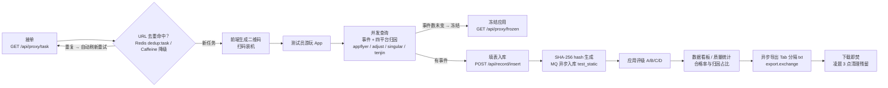
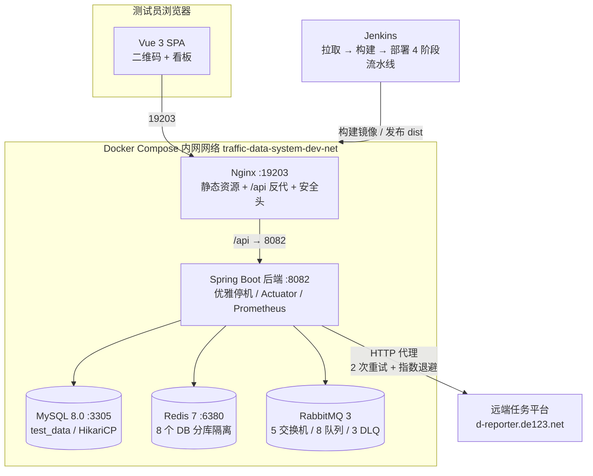
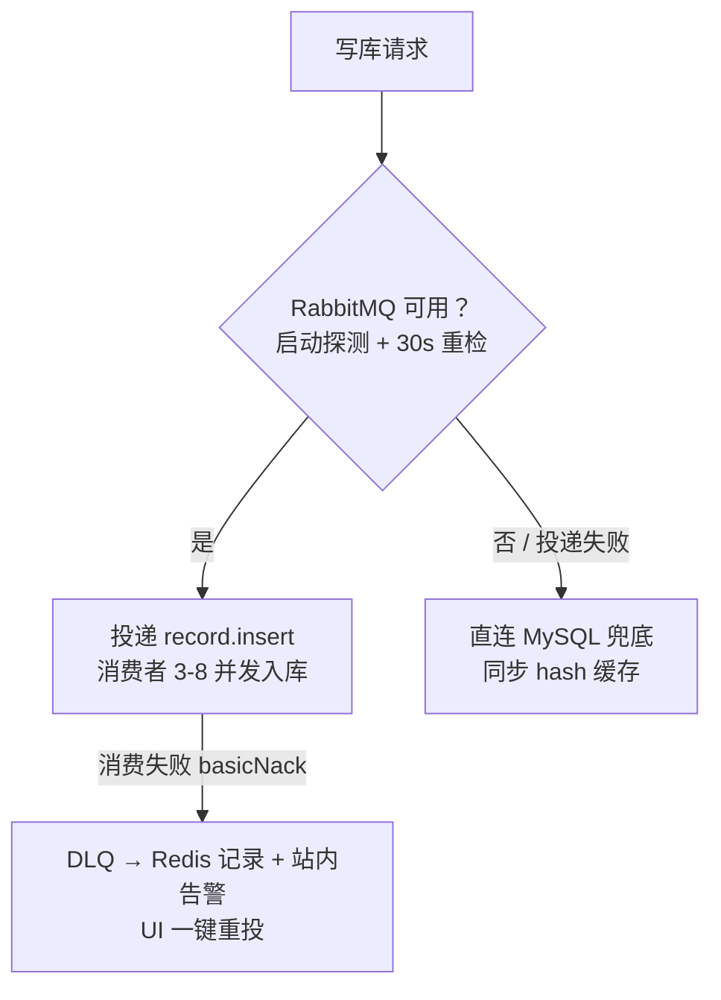
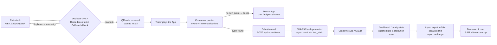
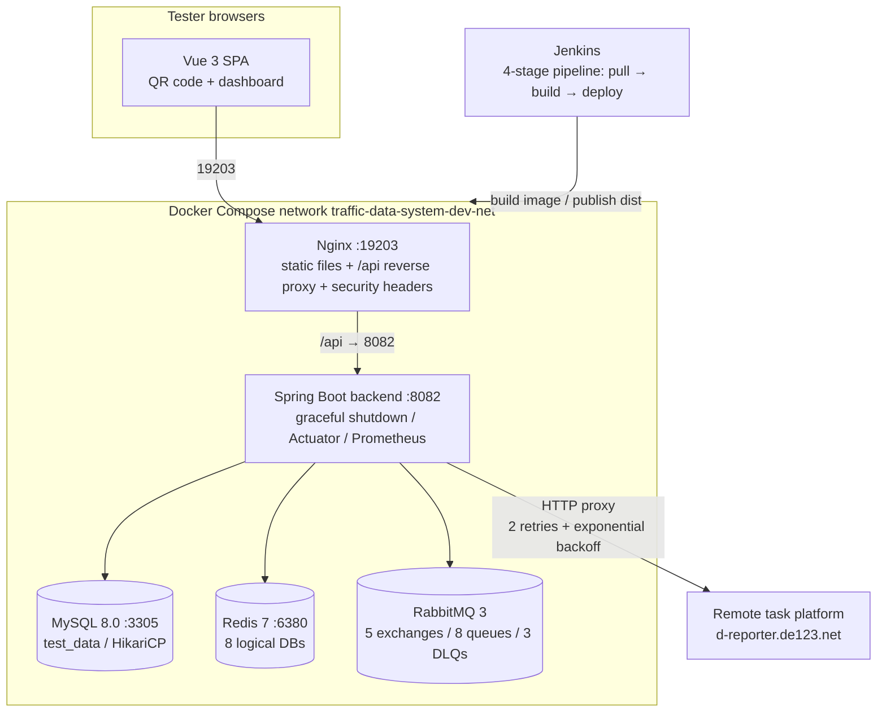

# 🎮 自动化测试数据管理系统（游戏测试 TDM）

> **Data-Traffic-System** · 移动广告归因测试的一站式数据管理平台
>
> 领任务 → 扫码装机 → 游玩测试 → 四平台归因 → 入库评级 → 导出报表，全流程点一点就完事。

<!-- Badge Row 1: 项目身份与版本 -->
[](https://github.com/MacawParrot-g/data-traffic-system-YQ5287476)
[](https://spring.io/projects/spring-boot)
[](https://vuejs.org)

<!-- Badge Row 2: 基础设施 -->
[](https://www.mysql.com)
[](https://redis.io)
[](https://www.rabbitmq.com)
[](https://docs.docker.com/compose/)

<!-- Badge Row 3: 项目属性 -->
[]()
[]()

> 💡 **Badge 说明**：本项目为内部自用工具（无开源协议），Badge 信息如与实际不符可手动删除或修改。

---

## 📖 目录

- [项目简介](#-项目简介)
- [核心特性](#-核心特性)
- [业务逻辑链](#-业务逻辑链)
- [系统架构](#-系统架构)
- [消息与缓存设计](#-消息与缓存设计)
- [技术栈](#-技术栈)
- [快速开始](#-快速开始)
- [使用指南](#-使用指南)
- [韧性设计亮点](#-韧性设计亮点)
- [目录结构](#-目录结构)
- [已知注意点](#-已知注意点)
- [致谢与彩蛋](#-致谢与彩蛋)
- [English Version](#-english-version)

---

## 🎯 项目简介

这是一套服务于**移动广告投放归因测试**的测试数据管理系统（TDM）。测试员在投放平台上领取 App 测试任务，扫码安装后游玩，系统自动查询**事件数据**与 **Appsflyer / Adjust / Singular / Tenjin 四家归因平台（MMP）**的归因结果：有归因则入库，无归因则冻结，最后按人统计合格率并导出报表。

作者在 `Main.java` 里留下的设计初衷（原话）：

> "这个程序设计之初是我用来减轻工作量的，系统投入使用之后再也不用手动去 json 里抄数据了，跑完数据之后点一下自动显示事件和归因，真的太爽了（邪恶）。"

一句话：**把"手工翻 JSON 抄数据"变成"点一下，事件和归因自动出来"**。

后端为 Spring Boot 3.2.0 单体服务（15 个 Controller、约 75 个 API 端点），前端为无路由库的轻量 Vue 3 单页应用（20 个面板组件），通过 Docker Compose 一键拉起 MySQL / Redis / RabbitMQ / Nginx / 后端五容器，Jenkins 流水线负责构建部署。

---

## ✨ 核心特性

- 🧩 **完整业务闭环**：领任务、二维码分发装机、事件/归因查询、冻结、入库、评级、导出报表，一套界面跑通。
- 🚀 **四平台归因并发聚合**：`Promise.all` 并发查询四家 MMP 平台，自动取 `lastReportTime` 作为记录日期，彩色标签区分归因状态。
- 🛡️ **自动 URL 去重**：Redis（`dedup:task:*`，TTL 1 天）+ Caffeine 本地降级，多 Pod 场景下会话心跳自动迁移，去重不中断。
- 📮 **MQ 异步入库 + 直连降级**：入库/更新/删除走 RabbitMQ 异步队列，MQ 挂掉时自动降级直连 MySQL，恢复后切回。
- 📤 **异步导出流水线**：全部 / 按日期 / 按勾选 hash 三种导出模式，执行 → 轮询 → 下载 → **下载即焚**（服务端自动删文件）。
- 👥 **三角色权限矩阵**：USER / ADMIN / DEVELOPER 按角色渲染菜单与面板，后端拦截器做真实鉴权。
- 📊 **数据可视化报表**：chart.js 五种图表（环形 / 双轴柱状 / 堆叠柱状 / 雷达 / 每人明细环图）呈现合格率与归因分布。
- 🛠️ **运维全家桶**：服务器监控（OSHI）、实时日志 tail、Redis 键浏览、远程终端、MQ 死信监控与一键重投、审计日志、动态定时任务、站内通知。
- 📚 **内置双文档系统**：NewbieGuide（三角色分 Tab 完整手册）与 DevGuide（含四平台返回结构详解），新人打开页面就能上手。

---

## 🔗 业务逻辑链

一次完整的测试业务闭环如下（自动模式主流程）：



六步拆解：

1. **接单**：后端代理转发远端任务平台 `d-reporter.de123.net` 的取任务接口，返回 `downloadUrl + bundleId`，前端用 qrcode 库渲染成 256px 二维码。
2. **自动去重**：领取的 URL 先在 Redis（`dedup:task:{url}::{bundleId}`）里查重，命中则前端 1.5 秒后自动重刷（最多 5 次）；任务池空了还能选择"继续轮询"或"近 3 天随机复测"。
3. **测试与归因**：测试员扫码游玩后点"查询事件"，前端并行请求事件接口与四家归因平台。事件数变化 → 有归因，可入库；无变化 → 可一键冻结该应用。
4. **入库**：填异常类型（10 个预设）、备注（模板化）、记录日期（普通用户强制取归因返回的 `lastReportTime`），服务端生成 SHA-256 hash（碰撞检测 10 次重试 + UUID 兜底），投递 MQ 由消费者（3-8 并发、手动 ack）写入 `test_static` 表。
5. **评级与统计**：给应用打 A/B/C/D 评级（已评级 Bundle 禁止重复评分），管理员面板按"合格 = 归因非空"口径统计合格率、四渠道归因占比、按记录人汇总。
6. **导出**：导出任务投递 `export.exchange`，消费者按模式查询未导出记录写 Tab 分隔 txt（文件名 `export_{user}_{时间戳}.txt`），完成后置 `isOutput=1`；前端每 2 秒轮询状态，就绪后点击下载，服务端下载即删。次日定时任务重置导出标记，周而复始。

手动模式（ManualMode）是特殊场景通道：手动输入 App ID 换下载链接，**无自动去重、无评级、无复测**。开发者模式（DevMode）则额外提供四平台独立归因查询面板与在线数据治理能力。

---

## 🏗️ 系统架构

五容器 Docker Compose 拓扑（Jenkins 负责构建与发布）：



端口对照：

| 服务 | 宿主机端口 | 容器内端口 | 说明 |
|---|---|---|---|
| Nginx | 19203 | 19203 | 托管前端 dist + `/api` 反代，静态资源 30 天强缓存 |
| 后端 | 8082 | 8082 | Spring Boot，`/swagger-ui.html` 可访问 |
| MySQL | 13306 | 3305 | 非默认端口，健康检查依赖 `mysqladmin ping` |
| Redis | 16379 | 6380 | `appendonly yes` 持久化 |
| RabbitMQ | 5672（内网） | 5672 | 3-management 镜像，管理台 15672 |

CI/CD 流水线（Jenkinsfile）四阶段：强制清理并拉取代码 → `mvn clean package` 构建后端并打镜像 → `npm install && npm run build` 构建前端到 `nginx/html/dist` → 生成 `.env`（凭据来自 Jenkins 凭据库）并 `docker compose up -d`，最后重载 Nginx。

---

## 📨 消息与缓存设计

### RabbitMQ 交换机与队列

| Exchange | Queue | Routing Key | 死信去向 | 消费者 |
|---|---|---|---|---|
| `record.exchange` | `record.insert.queue` | `record.insert` | `record.insert.dlq` | RecordMessageConsumer（3-8 并发） |
| `record.update.exchange` | `record.update.queue` | `record.update` | `record.update.dlq` | RecordUpdateMessageConsumer |
| `record.delete.exchange` | `record.delete.queue` | `record.delete` | `record.delete.dlq` | RecordDeleteMessageConsumer |
| `export.exchange` | `export.file.queue` | `export.file` | 无 | ExportMessageConsumer |
| `audit.exchange` | `audit.log.queue` | `audit.log` | 无 | AuditLogMessageConsumer |

关键机制：发布端开启 `publisher-confirm` + `publisher-returns`；消费端手动 ack、失败 `basicNack` 不重回原队列，由 DLX 转投死信队列。`DlqMessageConsumer` 监听三个 DLQ，把死信写入 Redis（滚动保留 200 条、TTL 72 小时）、向管理员发站内告警，并支持 UI **一键重投**回原交换机。

### Redis 分库隔离（单实例 8 个 DB）

| DB | 用途 | 关键 Key |
|---|---|---|
| db1 | URL 自动去重 | `dedup:task:{url}::{bundleId}` |
| db2 | 去重会话（多 Pod 容灾） | `dedup:session:{username}`、`dedup:pod:heartbeat:{podId}` |
| db3 | 应用评级缓存 | `grade:bundleIds`、`grade:record` |
| db5 | 踢人封禁 | `ban:uid:*` |
| db7 | 开发者测试历史 | `dev:history:*`（list，TTL 7 天） |
| db10 | hash 唯一性缓存 | `hash:unique:{hash}` |
| db11 | AppId 缓存 | `appid:cache`、`appid:bundle:map` |

启动时通过 Redis 分布式锁（Lua 防误删）保证多副本下只有一个 Pod 执行 MySQL → Redis 去重数据预热。

---

## 🛠️ 技术栈

| 层 | 技术 | 版本 / 说明 |
|---|---|---|
| 后端框架 | Spring Boot | 3.2.0 |
| ORM | MyBatis-Plus + 注解 SQL | 3.5.5，`GeneranMapper` 集中约 40 条 SQL |
| 数据库 | MySQL + HikariCP | 8.0，连接池精细调优（leak-detection、keepalive、JMX） |
| 缓存 | Redis（Lettuce） + Caffeine | Redis 7；Caffeine 3.1.8 作本地降级 |
| 消息队列 | RabbitMQ | Spring AMQP，手动 ack + DLX/DLQ |
| 前端 | Vue 3 + Vite | 3.4 / 5.4，**无 vue-router、无 Pinia、无 axios**（原生 fetch + AbortController 超时） |
| 图表 | chart.js | 4.5.1 |
| 二维码 | qrcode | 1.5.3 |
| 监控 | Actuator + Micrometer Prometheus + OSHI | 暴露 health/info/metrics/prometheus |
| 文档 | springdoc-openapi | Swagger UI |
| 安全 | spring-security-crypto | BCrypt 密码加密 |
| 限流 | 自研 RateLimitInterceptor | IP 滑动窗口 200 次/分（Bucket4j 已引入但未启用） |
| 部署 | Docker Compose + Jenkins | 五容器编排 + 四阶段流水线 |

---

## 🚀 快速开始

### 本地开发

后端（需 JDK 与本机 MySQL / Redis / RabbitMQ，注意 pom 编译目标为 Java 26）：

```bash
cd backend
# 修改 application.yml 中的 datasource / redis / rabbitmq 连接地址
mvn spring-boot:run        # 默认端口 8082
```

前端：

```bash
cd frontend
npm install
npm run dev                # Vite 开发服务器
# npm run build 会将产物输出到 ../nginx/html/dist
```

### 生产部署（Docker Compose）

```bash
# 1. 准备 .env（凭据请勿提交到仓库）
cat > .env << ENVEOF
MYSQL_ROOT_PASSWORD=xxxx
MYSQL_USER=remote_user
MYSQL_PASSWORD=xxxx
RABBITMQ_USER=xxxx
RABBITMQ_PASSWORD=xxxx
ENVEOF

# 2. 构建后端镜像（或由 Jenkins 完成）
cd backend && mvn clean package -DskipTests && docker build --no-cache -t myapp-backend:latest .

# 3. 一键拉起
docker compose -f docker-compose.cicd.yml up -d
```

### Jenkins 一键部署

流水线会强制清理工作区 → 后端构建打镜像 → 前端构建 → 从 Jenkins 凭据生成 `.env` → 部署目录 `/opt/traffic-data-system-YQ5287476` 下 `docker compose up -d` → 重载 Nginx。

部署完成后访问：

| 入口 | 地址 |
|---|---|
| 系统首页 | `http://<服务器>:19203` |
| Swagger API 文档 | `http://<服务器>:8082/swagger-ui.html` |
| 健康检查 | `http://<服务器>:8082/actuator/health` |
| RabbitMQ 管理台 | 容器内 `15672` |

---

## 📚 使用指南

三种工作模式：

- **自动模式（AutoMode）**：标准流水线——领任务（自动去重 + 轮询 + 复测三层兜底）→ 二维码装机 → 定时查询（默认 60 秒倒计时）→ 四平台归因 → 入库 → 评级 → 快速导出。
- **手动模式（ManualMode）**：特殊场景通道，手输 App ID 换下载链接，无去重、无评级、无复测，适合处理异常任务。
- **开发者模式（DevMode）**：专业测试（四平台独立归因面板 + 今日测试历史）+ 数据治理（在线建表 / 改字段 / 执行 SQL / 跨库批量导入，带危险词黑名单拦截）。

角色权限矩阵：

| 能力 | USER | ADMIN | DEVELOPER |
|---|---|---|---|
| 自动 / 手动 / 二维码 / 数据看板 / 评级 | ✅ | ✅ | ✅ |
| 管理员看板 / 审计日志 / 定时任务 / 通知管理 | ❌ | ✅ | ✅ |
| 开发者模式 / 监控面板 / MQ 监控 | ❌ | ❌ | ✅ |

新成员打开系统会看到内置的新人指南（按角色分 Tab），无需外部文档即可上手。

---

## 🧱 韧性设计亮点

这套系统的工程灵魂是"**任何一个组件挂了，业务都不能停**"：

1. **MQ 运行时降级**：启动探测 + 每 30 秒重检 RabbitMQ 可用性，投递失败自动切换 MySQL 直连写入并同步 hash 缓存，恢复后无感切回异步模式。
2. **Redis 三级缓存策略**：去重 / 评级 / AppId / 开发历史均有本地降级（Caffeine / ConcurrentLinkedDeque / MySQL 直查），Redis 挂了照样干活，恢复自动切回。
3. **多 Pod 去重会话容灾**：去重会话绑定 Pod 心跳（10 秒一次），原 Pod 失联即自动迁移到新 Pod，K8s 多副本下用户去重不中断。
4. **优雅停机**：`server.shutdown: graceful` + 30 秒停机缓冲，异步线程池等待在途任务完成。
5. **死信可观测可恢复**：DLQ → Redis 记录（72h 窗口）→ 站内告警 → UI 一键重投，8 队列实时总览。
6. **可观测性**：Actuator 健康检查（rabbit/redis/db 三件套）、Prometheus 指标、MDC 注入用户名的结构化日志（100MB 滚动 / 30 天 / 3GB 上限）、OSHI 系统信息。
7. **审计日志**：AOP 环绕切面记录操作人 / 参数 / 耗时 / 结果，经 MQ 异步入库（失败降级直连），支持按保留天数清理。

降级链路示意：



---

## 📁 目录结构

```
data-traffic-system-YQ5287476
├── Jenkinsfile                  # 四阶段 CI/CD 流水线
├── docker-compose.cicd.yml      # 五容器编排（mysql/redis/rabbitmq/backend/nginx）
├── backend/                     # Spring Boot 3.2.0 后端
│   ├── Dockerfile               # eclipse-temurin:17-jdk-alpine
│   ├── pom.xml
│   └── src/main/
│       ├── java/org/example/
│       │   ├── controller/      # 15 个 Controller（认证/数据/导出/评级/审计/监控...）
│       │   ├── service/         # 业务接口与实现
│       │   ├── mq/              # 5 组生产者/消费者 + DLQ 监听
│       │   ├── config/          # 拦截器、分布式锁、MQ/Redis 配置
│       │   ├── aop/             # 审计日志切面
│       │   ├── entity/ mapper/ util/ common/
│       │   └── Main.java        # 启动类（内含"邪恶"注释彩蛋）
│       └── resources/application.yml
├── frontend/                    # Vue 3 + Vite 前端
│   └── src/
│       ├── App.vue              # 外壳：登录 + 动态面板切换 + 角色菜单过滤
│       ├── api/index.js         # 约 75 个 API 函数（fetch + 超时 + X-User-Name 头）
│       └── components/          # 20 个面板组件（AutoMode/ManualMode/DevMode/AdminPanel...）
├── nginx/conf.d/nginx.conf      # 静态托管 + /api 反代 + 安全头 + 高可用重试
├── mysql/initsql/init.sql       # 初始化脚本（test_static 表）
├── redis/                       # 持久化数据目录
└── data/                        # 导出文件等数据目录
```

---

## ⚠️ 已知注意点

- **JDK 版本不一致**：`pom.xml` 编译目标为 Java 26，而 `Dockerfile` 使用 JDK 17 运行环境。构建机需安装匹配的 JDK，否则会出现 `UnsupportedClassVersionError`。
- **健康检查密码硬编码**：compose 中 MySQL 健康检查写死了 `-p12345678`，需与 `.env` 中的 `MYSQL_ROOT_PASSWORD` 保持一致。
- **init.sql 只建了 `test_static`**：`user`、`audit_log`、`grade_bundle`、`appid`、`notification`、`scheduled_task` 等表需要通过开发者模式在线 DDL 或手动脚本创建。
- **仓库缺少 `mysql/conf/my.cnf`**：compose 挂载了该文件以把 MySQL 端口改为 3305，首次部署前需自行提供，否则容器会按默认 3306 运行导致后端连不上。
- **安全边界**：`/api/system/terminal/exec` 可执行系统命令，远端任务平台接口无鉴权。**本项目仅限内网部署，切勿暴露公网**。
- **小瑕疵**：`Dockerfile` 的 `EXPOSE 8080` 与实际端口 8082 不符（仅文档作用）；限流拦截器日志文案写"封禁 3 分钟"，代码实际为 2 分钟；Bucket4j 依赖已引入但未使用。

---

## 🙏 致谢与彩蛋

### 致谢

感谢 Spring Boot、Vue、Vite、RabbitMQ、Redis、MySQL、chart.js、qrcode 等开源社区的优秀项目，以及 Appsflyer / Adjust / Singular / Tenjin 四家归因平台的开放文档。

### 彩蛋合集 🥚

1. **"邪恶"注释**（`Main.java` 开头）：作者坦承这套系统诞生的动机是"再也不用手动去 json 里抄数据了……真的太爽了（邪恶）"，并声明"此版本是我自己的自用版，禁止分享，违者必究"。如今它已经带着五容器编排和 Jenkins 流水线住进了服务器，属实"真香"。
2. **"学生时代"遗物**：`config/HTMLConfig.java` 是作者故意保留的大学时期代码，注释自述已无用——技术债也要讲情怀。
3. **"终极修复"注释**：`docker-compose.cicd.yml` 里 Nginx 的 entrypoint 前写着"【终极修复】1. 先清空挂载目录里的旧文件；2. 强制把新文件的所有者改为 www-data(101)"——运维的血泪经验，注释比代码更值钱。
4. **限流文案之谜**：`RateLimitInterceptor` 日志说"封禁 3 分钟"，代码里却是 2 分钟。真相只有一个，请以代码为准。

---

## 🌍 English Version

### Table of Contents

- [What Is This](#what-is-this)
- [Key Features](#key-features)
- [Business Logic Chain](#business-logic-chain)
- [Architecture](#architecture)
- [Messaging & Cache Design](#messaging--cache-design)
- [Tech Stack](#tech-stack)
- [Getting Started](#getting-started)
- [Usage Guide](#usage-guide)
- [Resilience Highlights](#resilience-highlights)
- [Project Structure](#project-structure)
- [Known Caveats](#known-caveats)
- [Credits & Easter Eggs](#credits--easter-eggs)

### What Is This

A **Test Data Management (TDM) system for mobile ad attribution testing**. Testers claim App testing tasks from a remote task platform, install the App by scanning a QR code, play it, and the system automatically queries **event data** and attribution results from **four MMP platforms: Appsflyer, Adjust, Singular and Tenjin**. Records with attribution are inserted into the database; those without are frozen. Qualified rates are computed per recorder and exported as reports.

As the author wrote in `Main.java`: *"I designed this program to reduce my workload. After the system went live, I never had to manually copy data from JSON again — one click and events & attribution show up automatically. It feels great (evil)."*

Backend: Spring Boot 3.2.0 monolith (15 controllers, ~75 API endpoints). Frontend: a router-free lightweight Vue 3 SPA (20 panel components). Deployment: Docker Compose (MySQL / Redis / RabbitMQ / Nginx / backend) orchestrated by a Jenkins pipeline.

### Key Features

- 🧩 **Complete business loop**: task claiming → QR code install → event & attribution query → freeze → insert → grading → export, all in one UI.
- 🚀 **Concurrent 4-platform attribution aggregation**: `Promise.all` queries four MMPs in parallel, `lastReportTime` is auto-picked as the record date, colored labels show attribution status.
- 🛡️ **Automatic URL deduplication**: Redis (`dedup:task:*`, TTL 1 day) with Caffeine local fallback; multi-pod session heartbeat migration keeps dedup alive.
- 📮 **Async MQ insert with direct-DB fallback**: insert/update/delete go through RabbitMQ; when MQ is down the system silently falls back to direct MySQL writes and switches back on recovery.
- 📤 **Async export pipeline**: three modes (all / by date / by selected hashes); execute → poll → download → **burn after download** (server deletes the file).
- 👥 **Three-role permission matrix**: USER / ADMIN / DEVELOPER get different menus and panels; real authorization enforced by backend interceptors.
- 📊 **Data visualization**: five chart.js charts (doughnut / dual-axis bar / stacked bar / radar / per-recorder doughnut) for qualified rates and attribution distribution.
- 🛠️ **Ops toolkit**: system monitor (OSHI), live log tail, Redis key browser, remote terminal, MQ dead-letter monitor with one-click retry, audit logs, dynamic scheduled tasks, in-app notifications.
- 📚 **Built-in dual documentation**: NewbieGuide (role-tabbed manual) and DevGuide (MMP response structure explained) — no external docs needed.

### Business Logic Chain

The main loop in Auto Mode:



Step by step: (1) the backend proxies the remote platform `d-reporter.de123.net` to claim a task and returns `downloadUrl + bundleId`, which the frontend renders into a 256px QR code; (2) the URL is deduplicated against Redis, with auto-refresh on duplicates and optional task-pool polling or random retest from the last 3 days; (3) after playing, "query event" fires parallel requests to the event endpoint and four attribution platforms; (4) on attribution, the record is submitted with a SHA-256 hash (collision retried up to 10 times, UUID fallback) and inserted into `test_static` via MQ consumers (3-8 concurrency, manual ack); (5) the App gets an A/B/C/D grade and admin statistics compute qualified rates (qualified = non-empty attribution); (6) exports are assembled by a consumer writing Tab-separated txt files, marked `isOutput=1`, polled by the frontend every 2 seconds, downloaded and deleted server-side.

Manual Mode is the special-case lane (no dedup / grading / retest); Dev Mode adds per-platform attribution panels and online data governance.

### Architecture

Five-container Docker Compose topology with Jenkins build & release:



Ports: Nginx 19203, backend 8082, MySQL 13306→3305, Redis 16379→6380, RabbitMQ 5672 (internal). The Jenkinsfile runs four stages: force-clean & pull → `mvn clean package` + docker build → `npm run build` into `nginx/html/dist` → generate `.env` from Jenkins credentials and `docker compose up -d`, then reload Nginx.

### Messaging & Cache Design

| Exchange | Queue | Routing Key | DLQ | Consumer |
|---|---|---|---|---|
| `record.exchange` | `record.insert.queue` | `record.insert` | `record.insert.dlq` | RecordMessageConsumer (3-8) |
| `record.update.exchange` | `record.update.queue` | `record.update` | `record.update.dlq` | RecordUpdateMessageConsumer |
| `record.delete.exchange` | `record.delete.queue` | `record.delete` | `record.delete.dlq` | RecordDeleteMessageConsumer |
| `export.exchange` | `export.file.queue` | `export.file` | none | ExportMessageConsumer |
| `audit.exchange` | `audit.log.queue` | `audit.log` | none | AuditLogMessageConsumer |

Publishers use correlated confirms with returns; consumers use manual acks; failed messages are dead-lettered (not requeued) and `DlqMessageConsumer` stores them in Redis (rolling 200, TTL 72h), alerts admins and supports UI one-click retry.

Redis logical DBs: db1 URL dedup, db2 dedup sessions & pod heartbeats, db3 grades, db5 bans, db7 dev history, db10 hash uniqueness, db11 AppId cache. A distributed lock (Lua compare-and-delete) ensures only one pod runs the MySQL→Redis warm-up at startup.

### Tech Stack

| Layer | Tech | Notes |
|---|---|---|
| Backend | Spring Boot 3.2.0 | MyBatis-Plus 3.5.5 + annotation SQL |
| Database | MySQL 8.0 + HikariCP | finely tuned pool (leak detection, keepalive, JMX) |
| Cache | Redis 7 (Lettuce) + Caffeine 3.1.8 | Caffeine as local fallback |
| MQ | RabbitMQ | Spring AMQP, manual ack + DLX/DLQ |
| Frontend | Vue 3.4 + Vite 5.4 | **no vue-router, no Pinia, no axios** — native fetch with AbortController |
| Charts | chart.js 4.5.1 | 5 chart types in AdminPanel |
| QR | qrcode 1.5.3 | download links → QR codes |
| Monitoring | Actuator + Prometheus + OSHI | health/info/metrics/prometheus |
| Docs | springdoc-openapi | Swagger UI |
| Rate limit | custom interceptor | 200 req/min per IP sliding window |
| Deployment | Docker Compose + Jenkins | 5 containers + 4-stage pipeline |

### Getting Started

Local backend (JDK matching the pom's Java 26 target required):

```bash
cd backend
# adjust datasource / redis / rabbitmq addresses in application.yml
mvn spring-boot:run        # port 8082
```

Local frontend:

```bash
cd frontend
npm install
npm run dev                # vite dev server
# npm run build outputs to ../nginx/html/dist
```

Production (Docker Compose):

```bash
# 1. prepare .env (never commit credentials)
cat > .env << ENVEOF
MYSQL_ROOT_PASSWORD=xxxx
MYSQL_USER=remote_user
MYSQL_PASSWORD=xxxx
RABBITMQ_USER=xxxx
RABBITMQ_PASSWORD=xxxx
ENVEOF

# 2. build the backend image (or let Jenkins do it)
cd backend && mvn clean package -DskipTests && docker build --no-cache -t myapp-backend:latest .

# 3. bring everything up
docker compose -f docker-compose.cicd.yml up -d
```

Entry points after deployment: home page `http://<server>:19203`, Swagger `http://<server>:8082/swagger-ui.html`, health `http://<server>:8082/actuator/health`, RabbitMQ management console at container port 15672.

### Usage Guide

Three working modes: **Auto Mode** (standard pipeline with dedup, polling and retest fallbacks), **Manual Mode** (App-ID-only lane for special cases), **Dev Mode** (per-platform attribution panels + online DDL / SQL console / cross-database import with dangerous-keyword filtering). Roles: USER (basic panels), ADMIN (+ admin dashboard, audit, scheduled tasks, notifications), DEVELOPER (+ dev mode, system monitor, MQ monitor). A built-in NewbieGuide walks new members through everything by role.

### Resilience Highlights

The engineering soul of this system is "**no single component outage may stop the business**": runtime MQ degradation (30s probing + direct-DB fallback + automatic switch-back), Redis three-tier cache strategy with local fallbacks, multi-pod dedup session heartbeat migration, graceful shutdown with 30s buffer, observable & recoverable dead letters (Redis window + in-app alerts + UI retry), observability (Actuator health for rabbit/redis/db, Prometheus, MDC-structured logs, OSHI), and AOP audit logging with direct-DB fallback.

### Project Structure

```
data-traffic-system-YQ5287476
├── Jenkinsfile                  # 4-stage CI/CD pipeline
├── docker-compose.cicd.yml      # 5-container orchestration
├── backend/                     # Spring Boot 3.2.0
│   ├── Dockerfile               # eclipse-temurin:17-jdk-alpine
│   ├── pom.xml
│   └── src/main/java/org/example/
│       ├── controller/          # 15 controllers
│       ├── service/  mq/  config/  aop/  entity/  mapper/  util/  common/
│       └── Main.java            # entrypoint (with the "evil" comment easter egg)
├── frontend/                    # Vue 3 + Vite
│   └── src/  App.vue  api/index.js  components/  # 20 panel components
├── nginx/conf.d/nginx.conf      # static hosting + /api proxy + security headers
├── mysql/initsql/init.sql       # bootstrap script (test_static only)
├── redis/                       # persistence dir
└── data/                        # export & misc data dirs
```

### Known Caveats

- **JDK mismatch**: pom targets Java 26 while the Dockerfile runs JDK 17 — build machines must have a matching JDK or you will hit `UnsupportedClassVersionError`.
- **Hardcoded healthcheck password**: compose hardcodes `-p12345678` for MySQL health checks; keep it in sync with `.env`.
- **init.sql only creates `test_static`**: tables like `user`, `audit_log`, `grade_bundle`, `appid`, `notification`, `scheduled_task` must be created via Dev Mode online DDL or manual scripts.
- **Missing `mysql/conf/my.cnf`**: compose mounts this file to switch MySQL to port 3305; provide it before first deploy or MySQL will stay on 3306 and the backend will fail to connect.
- **Security boundary**: `/api/system/terminal/exec` can run arbitrary system commands and the remote platform has no auth. **Intranet deployment only — never expose it to the public internet.**
- **Minor quirks**: `EXPOSE 8080` in the Dockerfile vs actual port 8082; the rate-limit log says "banned 3 minutes" while the code bans for 2; Bucket4j is declared but unused.

### Credits & Easter Eggs

Credits: the open-source communities behind Spring Boot, Vue, Vite, RabbitMQ, Redis, MySQL, chart.js, qrcode, and the public docs of Appsflyer / Adjust / Singular / Tenjin.

Easter eggs 🥚: (1) the "evil" comment in `Main.java` — the author confesses this tool exists so he never has to copy data out of JSON again, "it feels great (evil)", originally marked "self-use only, no sharing" — it now lives on servers with five containers and a Jenkins pipeline; (2) `HTMLConfig.java` is a deliberately kept relic from the author's student days; (3) the "【终极修复】" comment in docker-compose documents the painful Nginx permission fix; (4) the rate-limit "3 minutes vs 2 minutes" mystery — trust the code, not the log message.

---

> 💡 本 README 基于前后端代码与 docker-compose / Jenkinsfile 实际内容整理生成。若部署方式或业务细节有变化，请同步更新本文档。
